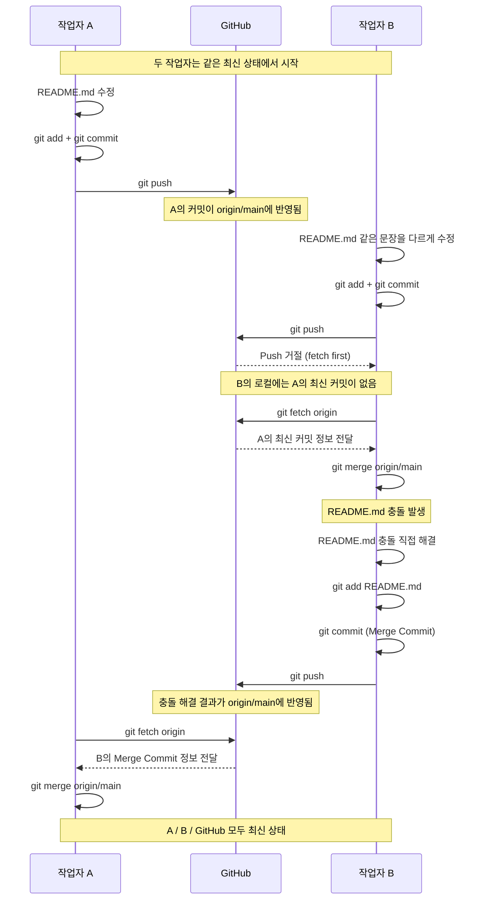

# 2026-git-start
2026-git-start

로컬 컴퓨터에서 추가한 내용입니다.
GitHub 웹에서 추가한 내용입니다.

# 작업자 A·B의 Fetch, Merge 및 충돌 해결 — 시퀀스 다이어그램

​
    

```mermaid
sequenceDiagram
    participant A as 작업자 A
    participant G as GitHub
    participant B as 작업자 B

    Note over A,B: 두 작업자는 같은 최신 상태에서 시작

    A->>A: README.md 수정
    A->>A: git add + git commit
    A->>G: git push

    Note over G: A의 커밋이 origin/main에 반영됨

    B->>B: README.md 같은 문장을 다르게 수정
    B->>B: git add + git commit

    B->>G: git push
    G-->>B: Push 거절 (fetch first)

    Note over B,G: B의 로컬에는 A의 최신 커밋이 없음

    B->>G: git fetch origin
    G-->>B: A의 최신 커밋 정보 전달

    B->>B: git merge origin/main
    Note over B: README.md 충돌 발생

    B->>B: README.md 충돌 직접 해결
    B->>B: git add README.md
    B->>B: git commit (Merge Commit)

    B->>G: git push

    Note over G: 충돌 해결 결과가 origin/main에 반영됨

    A->>G: git fetch origin
    G-->>A: B의 Merge Commit 정보 전달
    A->>A: git merge origin/main

    Note over A,B: A / B / GitHub 모두 최신 상태
```
